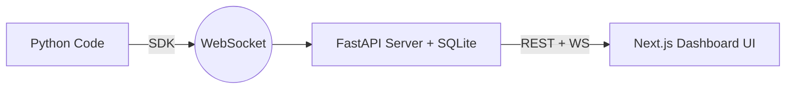

<div align="center">
  <h1>AgentScope</h1>
  <p><em>Lightweight observability for multi-agent AI pipelines</em></p>

  <!-- Badges -->
  <a href="https://opensource.org/licenses/Apache-2.0">
    
  </a>
  <a href="https://www.python.org/downloads/">
    
  </a>
  <a href="https://nodejs.org/">
    
  </a>
  <a href="https://github.com/archittmittal/AgentsScope/pulls">
    
  </a>
  <a href="https://github.com/archittmittal/AgentsScope/stargazers">
    
  </a>

  <p>Add two lines of Python and see everything your AI agents are doing.</p>
</div>

<br />

## The Core Value Prop

**AgentScope** is a lightweight, open-source, self-hosted observability dashboard designed specifically for multi-agent AI pipelines. 

Running complex agent setups often feels like running completely blind—you add `verbose=True`, comb through endless walls of text in the console, and guess where an error occurred. With AgentScope, you **add 2 lines of Python, and instantly see everything your agents do** on a clean, local dashboard.

Keep track of real-time events, visualize your agent DAG, monitor token usage, and browse past session history—all without relying on an external cloud provider.

**Self-hosted. No accounts. No cloud dependency.**

## Quick Demo

**BEFORE**: Running agents blindly, adding `verbose=True`, reading walls of text.

**AFTER**: Two lines of code, a beautiful dashboard showing exactly what happened.

```python
from agentscope import AgentScopeCallback

cb = AgentScopeCallback(session_name="my_pipeline")
agent.run(input, callbacks=[cb])

# That's it. Open http://localhost:3000
```

## Features

- **Real-time Event Feed** — Watch your agents work in real-time
- **Agent DAG Graph** — Visualize the full call hierarchy
- **Token Counter** — Track token usage and estimated costs
- **Event Inspector** — Click any event to see full prompt + completion text
- **Stats Dashboard** — Token breakdown, latency heatmap, error log
- **Session History** — Browse past runs, compare results
- **One-Command Setup** — `docker compose up` and you're running
- **LangChain Integration** — Works with LangChain 0.2+ out of the box
- **Self-Hosted** — Your data stays on your machine
- **Zero Impact** — SDK never blocks your agent pipeline

## Getting Started (5 minutes)

### Option 1: Docker (Recommended)

The easiest way to run the backend and UI:

```bash
git clone https://github.com/archittmittal/AgentsScope.git
cd AgentsScope
docker compose up
```

- Dashboard UI: http://localhost:3000
- Backend API/WS: http://localhost:8765

### Option 2: Manual Setup

If you prefer to run it manually:

```bash
# Server
cd packages/server
pip install -r requirements.txt
uvicorn main:app --host 0.0.0.0 --port 8765

# UI (new terminal)
cd packages/ui
npm install
npm run dev

# SDK (In your project)
pip install agentscope
```

### Instrument Your Code

Now, just drop the callback into your code!

```python
from langchain_openai import ChatOpenAI
from langchain.chains import LLMChain
from agentscope import AgentScopeCallback

# 1. Initialize the callback
cb = AgentScopeCallback(session_name="my_first_trace")

llm = ChatOpenAI(model="gpt-4o")
chain = LLMChain(llm=llm, prompt=prompt)

# 2. Add it to your callbacks
result = chain.invoke(
    {"question": "What is quantum computing?"},
    config={"callbacks": [cb]}
)

# Open http://localhost:3000 — your trace is there!
```

## Architecture



## Usage Examples

### 1. Basic LLM Chain
```python
from langchain_core.prompts import PromptTemplate
from langchain_openai import ChatOpenAI
from agentscope import AgentScopeCallback

cb = AgentScopeCallback(session_name="basic_chain")
prompt = PromptTemplate.from_template("Tell me a joke about {topic}")
chain = prompt | ChatOpenAI()

chain.invoke({"topic": "developers"}, config={"callbacks": [cb]})
```

### 2. Multi-Agent Pipeline (AgentExecutor)
```python
from langchain.agents import create_react_agent, AgentExecutor
from agentscope import AgentScopeCallback

cb = AgentScopeCallback(session_name="react_agent")
agent = create_react_agent(llm, tools, prompt)
agent_executor = AgentExecutor(agent=agent, tools=tools)

agent_executor.invoke({"input": "Search for the weather in NY"}, config={"callbacks": [cb]})
```

### 3. Custom Function Trace
```python
from agentscope.decorators import trace

@trace(name="My Custom Step")
def process_data(data):
    return f"Processed {data}"
```

## Configuration

You can configure the server and UI using the following environment variables:

| Variable | Default | Description |
|---|---|---|
| `DATABASE_URL` | `sqlite:///~/.agentscope/agentscope.db` | Database connection string |
| `HOST` | `0.0.0.0` | Server host |
| `PORT` | `8765` | Server port |
| `LOG_LEVEL` | `info` | Logging level |
| `NEXT_PUBLIC_API_URL` | `http://localhost:8765` | API URL for UI |
| `NEXT_PUBLIC_WS_URL` | `ws://localhost:8765` | WebSocket URL for UI |

## Project Structure

```text
agentscope/
├── packages/
│   ├── sdk/          # Python SDK & LangChain Callbacks
│   ├── server/       # FastAPI Backend & SQLite Models
│   └── ui/           # Next.js 14 Frontend
├── docker-compose.yml
├── README.md
└── CONTRIBUTING.md
```

## Tech Stack

| Component | Technology |
|---|---|
| **SDK** | Python 3.10+, Pydantic v2, websockets |
| **Server** | FastAPI, SQLAlchemy, SQLite, uvicorn |
| **UI** | Next.js 14, React Flow, Recharts, Zustand, Tailwind CSS |

## Contributing

We welcome contributions! Please see our [CONTRIBUTING.md](./CONTRIBUTING.md) file for more details.

1. Fork the Project
2. Create your Feature Branch (`git checkout -b feature/AmazingFeature`)
3. Commit your Changes (`git commit -m 'feat(ui): Add AmazingFeature'`) - *We use Conventional Commits!*
4. Run tests before submitting
5. Push to the Branch (`git push origin feature/AmazingFeature`)
6. Open a Pull Request

## Roadmap

- [x] LangChain integration
- [x] Real-time event feed
- [x] Agent DAG graph
- [ ] CrewAI integration
- [ ] AutoGen integration
- [ ] Live DAG updates
- [ ] Prompt diff view
- [ ] Export to JSON/CSV

## FAQ

**Q: Is this production-ready?**  
A: AgentScope is primarily a developer tool designed for local debugging and observability during the development of your pipelines.

**Q: Does it work with CrewAI?**  
A: Not yet. We are starting with robust LangChain support, but CrewAI integration is on the roadmap.

**Q: Where is my data stored?**  
A: Your data never leaves your machine. It is stored locally in an SQLite database located at `~/.agentscope/agentscope.db`.

**Q: Does the SDK slow down my agents?**  
A: No. All events are emitted as fire-and-forget messages in background tasks, resulting in zero impact on your agent's performance.

## License

Distributed under the Apache License 2.0. See `LICENSE` for more information.

## Acknowledgments

A huge thank you to the open-source tools that made AgentScope possible:
- [LangChain](https://github.com/langchain-ai/langchain)
- [FastAPI](https://github.com/tiangolo/fastapi)
- [React Flow](https://reactflow.dev/)
- [Next.js](https://nextjs.org/)
