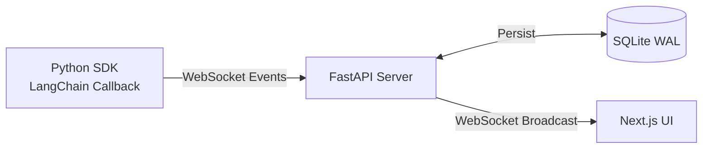

# AgentScope: Guidelines for AI Coding Agents

AgentScope is a lightweight, open-source, self-hosted observability dashboard for multi-agent AI pipelines. This `AGENTS.md` file serves as guidance for AI coding agents (like GitHub Copilot, Cursor, Claude, etc.) working on this codebase.

## 1. Project Overview for AI Agents

- AgentScope is a three-module system: Python SDK, FastAPI Server, Next.js UI
- Data flows one direction: **SDK → Server → UI**
- The SDK instruments LangChain pipelines via callback handlers
- The Server receives events via WebSocket, persists to SQLite, broadcasts to UI
- The UI renders real-time event feeds, agent DAG graphs, token counters, and session history



## 2. Repository Structure

```text
agentscope/
├── packages/
│   ├── sdk/           # Python SDK — LangChain callback handler + WebSocket client
│   │   ├── agentscope/
│   │   │   ├── __init__.py
│   │   │   ├── callback.py      # Core: AsyncCallbackHandler subclass
│   │   │   ├── client.py        # WebSocket client with reconnection
│   │   │   ├── models.py        # Pydantic v2 event models
│   │   │   ├── decorators.py    # @trace decorator
│   │   │   └── _pricing.py      # Token cost lookup
│   │   ├── tests/
│   │   ├── setup.py
│   │   └── pyproject.toml
│   ├── server/        # FastAPI server — REST + WebSocket + SQLite
│   │   ├── main.py
│   │   ├── ws_manager.py        # Dual-pool WebSocket manager
│   │   ├── database.py          # SQLAlchemy engine + session factory
│   │   ├── models.py            # SQLAlchemy ORM models
│   │   ├── schemas.py           # Pydantic response schemas
│   │   ├── graph_layout.py      # Dagre-based node positioning
│   │   ├── routers/
│   │   │   ├── sessions.py
│   │   │   └── events.py
│   │   ├── tests/
│   │   └── requirements.txt
│   └── ui/            # Next.js 14 dashboard — React Flow + Recharts + Zustand
│       ├── app/                  # App Router pages
│       ├── components/           # React components
│       ├── hooks/                # Custom hooks (useWebSocket, useSession, useEvents)
│       ├── store/                # Zustand state management
│       ├── lib/                  # Utilities and API client
│       ├── types/                # TypeScript type definitions
│       └── package.json
├── examples/          # Runnable integration examples
├── docs/              # Project documentation
├── docker-compose.yml
├── Makefile
└── README.md
```

## 3. Critical Rules for AI Agents

These are hard rules that must NEVER be violated:

> [!CAUTION]
> 1. **Use LangChain's `run_id` as `event_id`** — Never generate new UUIDs for events. LangChain provides `run_id` (UUID) and `parent_run_id` on every callback. Use them directly as `event_id` and `parent_event_id`.
> 2. **SDK must NEVER block the agent pipeline** — All event emission is fire-and-forget via asyncio.Queue + background task. Callbacks must return immediately. Never raise exceptions into the calling agent code.

> [!IMPORTANT]
> 3. **Server computes graph layout, not the UI** — Dagre layout runs server-side. The UI receives `{ nodes: [{id, position, data}], edges: [] }` and passes it to React Flow.
> 4. **Data flows SDK → Server → UI only** — The UI never writes data to the server except for session deletion (DELETE).
> 5. **Token cost is estimated, not exact** — Use `LLMResult.llm_output.token_usage` when available. Never implement tiktoken or similar. Show '—' when data is unavailable.
> 6. **SQLite with WAL mode** — Always `PRAGMA journal_mode=WAL` for concurrent read/write.
> 7. **No heavy component libraries** — Tailwind CSS + shadcn/ui only. No MUI, Chakra, Ant Design.
> 8. **React Flow, not D3** — For the agent DAG graph.

## 4. Module-Specific Guidance

### SDK (Python)
- All callback methods follow the pattern: construct `AgentEvent` → call `self._emit(event)`
- The WebSocket client runs in a background asyncio task
- Events are buffered in an `asyncio.Queue` if the server is unreachable
- Reconnection uses exponential backoff (1s → 2s → 4s → 8s → max 30s)
- Dependencies: `websockets`, `pydantic` (required); `langchain-core` (optional)
- Test with: `pytest`, mock WebSocket connections

### Server (Python)
- FastAPI with uvicorn, runs on port `8765`
- Two WebSocket pools: SDK (ingest) and UI (broadcast)
- Event flow: SDK sends → validate (Pydantic) → persist (SQLAlchemy) → broadcast (WebSocket)
- Graph layout uses dagre/networkx, computed on demand at `/graph` endpoint
- CORS: allow all origins (local dev tool)
- Test with: `pytest`, `httpx.AsyncClient` for API tests

### UI (TypeScript/Next.js)
- Next.js 14 with App Router, TypeScript strict mode
- State: Zustand store for sessions + live events
- Data fetching: SWR for REST, custom `useWebSocket` hook for real-time
- Components: `AgentGraph` (React Flow), `EventFeed`, `EventInspector`, `TokenCounter`
- Styling: Tailwind CSS, shadcn/ui primitives
- No default exports for components (use named exports)

## 5. Common Tasks for AI Agents

### Adding a new event type
1. Add to `EventType` enum in `packages/sdk/agentscope/models.py`
2. Add Pydantic model in same file
3. Add callback method in `packages/sdk/agentscope/callback.py`
4. Add SQLAlchemy handling in `packages/server/models.py`
5. Add to TypeScript types in `packages/ui/types/index.ts`
6. Add rendering in `packages/ui/components/EventFeed.tsx`

### Adding a new API endpoint
1. Add route in appropriate router (`packages/server/routers/`)
2. Add Pydantic schema in `packages/server/schemas.py`
3. Add TypeScript type in `packages/ui/types/index.ts`
4. Add API client function in `packages/ui/lib/api.ts`
5. Add SWR hook if needed in `packages/ui/hooks/`

### Adding a new UI component
1. Create in `packages/ui/components/`
2. Use TypeScript interface for props
3. Use Tailwind for styling
4. Named export only
5. Add tests in colocated `*.test.tsx` file

## 6. Environment Setup

```bash
# Server
cd packages/server
pip install -r requirements.txt
uvicorn main:app --host 0.0.0.0 --port 8765

# UI
cd packages/ui
npm install
npm run dev

# SDK (development)
cd packages/sdk
pip install -e .

# Full stack
docker compose up
```

## 7. Key Files to Understand First

1. [`packages/sdk/agentscope/callback.py`](file:///Users/architmittal/Desktop/CODE/AGENTSCOPE/packages/sdk/agentscope/callback.py) — The core integration point
2. [`packages/sdk/agentscope/client.py`](file:///Users/architmittal/Desktop/CODE/AGENTSCOPE/packages/sdk/agentscope/client.py) — WebSocket client with buffering
3. [`packages/sdk/agentscope/models.py`](file:///Users/architmittal/Desktop/CODE/AGENTSCOPE/packages/sdk/agentscope/models.py) — Canonical data models
4. [`packages/server/main.py`](file:///Users/architmittal/Desktop/CODE/AGENTSCOPE/packages/server/main.py) — Server entry point
5. [`packages/server/ws_manager.py`](file:///Users/architmittal/Desktop/CODE/AGENTSCOPE/packages/server/ws_manager.py) — Dual-pool WebSocket manager
6. [`packages/server/database.py`](file:///Users/architmittal/Desktop/CODE/AGENTSCOPE/packages/server/database.py) — Database setup
7. [`packages/server/models.py`](file:///Users/architmittal/Desktop/CODE/AGENTSCOPE/packages/server/models.py) — ORM models
8. [`packages/ui/store/sessionStore.ts`](file:///Users/architmittal/Desktop/CODE/AGENTSCOPE/packages/ui/store/sessionStore.ts) — Client state management
9. [`packages/ui/hooks/useWebSocket.ts`](file:///Users/architmittal/Desktop/CODE/AGENTSCOPE/packages/ui/hooks/useWebSocket.ts) — Real-time connection
10. [`packages/ui/components/AgentGraph.tsx`](file:///Users/architmittal/Desktop/CODE/AGENTSCOPE/packages/ui/components/AgentGraph.tsx) — DAG visualization

## 8. Testing Guidance

- Always write tests for new functionality
- SDK tests should mock WebSocket connections
- Server tests should use in-memory SQLite
- UI tests should mock API calls and WebSocket
- Run: `make test` from project root

---

## 9. Git & Pull Request Workflow (MANDATORY)

> [!CAUTION]
> **NEVER commit directly to `main`.** Every change — no matter how small — goes through a feature branch and a Pull Request. No exceptions.

### 9.1 Branch Rules

1. **Always create a new branch** before starting any work:
   ```bash
   git checkout main
   git pull origin main
   git checkout -b <branch-type>/<short-description>
   ```
2. **Branch naming convention:**
   | Type | Pattern | Example |
   |---|---|---|
   | Feature | `feat/<description>` | `feat/websocket-reconnection` |
   | Bug fix | `fix/<description>` | `fix/event-broadcast-race` |
   | Docs | `docs/<description>` | `docs/api-contract-update` |
   | Refactor | `refactor/<description>` | `refactor/simplify-ws-manager` |
   | Tests | `test/<description>` | `test/sdk-callback-coverage` |
   | Chores | `chore/<description>` | `chore/update-dependencies` |

3. **One branch per logical change.** Don't mix unrelated changes in a single branch.

### 9.2 Pre-PR Verification Checklist (MANDATORY)

Before creating a Pull Request, **verify ALL of the following**:

```
Step 1: Ensure you're on the correct branch (NOT main)
  → git branch --show-current
  → Must NOT be "main"

Step 2: Check for uncommitted changes
  → git status
  → Commit or stash everything

Step 3: Run linting / formatting
  → Python: black . && ruff check .
  → TypeScript: npx prettier --check . && npx eslint .

Step 4: Run tests
  → make test  (or module-specific: pytest / npm test)
  → ALL tests must pass. Do NOT create a PR with failing tests.

Step 5: Verify the build compiles
  → Server: python -c "from main import app"  (no import errors)
  → UI: npm run build  (no TypeScript errors)

Step 6: Review your own diff
  → git diff main..HEAD --stat
  → Confirm only intended files are changed
  → No debug prints, no commented-out code, no TODO hacks
```

> [!WARNING]
> If ANY verification step fails, **fix it before creating the PR**. Do not create a PR that you know is broken.

### 9.3 Commit Messages

Use **Conventional Commits** format — every commit message must follow this pattern:

```
<type>: <concise description>

[optional body with context]
```

| Type | When to use |
|---|---|
| `feat` | New feature or functionality |
| `fix` | Bug fix |
| `docs` | Documentation only |
| `refactor` | Code restructuring, no behavior change |
| `test` | Adding or updating tests |
| `chore` | Build config, dependencies, tooling |
| `perf` | Performance improvement |

Examples:
```
feat: add real-time event feed WebSocket hook
fix: handle SDK reconnection when server restarts mid-session
docs: add mem0 memory protocol to AGENTS.md
test: add unit tests for session PATCH endpoint
chore: pin fastapi to >=0.110.0,<1.0
```

### 9.4 Creating the Pull Request

When creating a PR:

1. **Title** follows Conventional Commits format: `feat: add event inspector panel`
2. **Description** must include:
   - **What** was changed (brief summary)
   - **Why** it was changed (motivation / context)
   - **How** it was tested (commands run, manual verification)
3. **Link to issue** — if this PR addresses a GitHub Issue, connect it:
   - Use `Closes #<issue-number>` or `Fixes #<issue-number>` in the PR body
   - This auto-closes the issue when the PR is merged
   - If it partially addresses an issue, use `Related to #<issue-number>` instead

   ```markdown
   ## Summary
   Added the EventInspector slide-in panel that shows full event payload
   when clicking any event in the feed.

   ## Changes
   - Created `EventInspector.tsx` component with syntax-highlighted JSON
   - Added Sheet component from shadcn/ui
   - Connected click handler in EventFeed to open inspector

   ## Testing
   - `npm run build` passes with no errors
   - Manually tested with mock event data
   - Added `EventInspector.test.tsx` with 4 test cases

   Closes #42
   ```

### 9.5 After PR Creation — Summary to User

After creating a PR, **always give the user a crisp summary** in this format:

```
PR #<number> created: <title>
   Branch: <branch-name> → main
   Issue:  Closes #<issue> (or "No linked issue")
   Changes: <1-2 sentence summary of what changed>
   Files:  <count> files changed
   Link:   <PR URL>
```

Example:
```
PR #23 created: feat: add real-time event feed
   Branch: feat/event-feed → main
   Issue:  Closes #12
   Changes: Added EventFeed component with WebSocket streaming and auto-scroll. Integrated with Zustand store.
   Files:  5 files changed
   Link:   https://github.com/user/agentscope/pull/23
```


> [!TIP]
> Keep the summary **short and scannable**. The user should know in 5 seconds what the PR does, whether it solves an issue, and where to find it. No walls of text.

### 9.6 Quick Reference — The Full Git Flow

```
1. git checkout main && git pull origin main
2. git checkout -b feat/my-feature
3. ... make changes ...
4. Run verification checklist (section 9.2)
5. git add -A && git commit -m "feat: my feature description"
6. git push -u origin feat/my-feature
7. Create PR → link issue → add description
8. Give user the crisp summary (section 9.5)
```

---

## 10. Mem0 Memory — Project Continuity

> [!IMPORTANT]
> This project uses **mem0** (MCP server) to persist project context across agent sessions. Every AI agent working on this codebase **MUST** follow the memory protocol below to maintain continuity.

### 10.1 Why This Matters

Without mem0 memory, every new agent session starts from scratch — the agent has to re-read files, re-discover project structure, and re-learn past decisions. Mem0 eliminates this by storing structured project knowledge that agents can retrieve instantly.

### 10.2 Memory Categories

The following memory categories are stored under `user_id: "architmittal"` with `metadata.project: "agentscope"`:

| Category | What It Contains |
|---|---|
| `overview` | Project location, description, license, module structure, data flow direction |
| `architecture` | SDK internals (AsyncCallbackHandler, WebSocket client, asyncio.Queue), Server (FastAPI, dual-pool WS, SQLite WAL, dagre), UI (Next.js 14, React Flow, Zustand, SWR) |
| `design-decisions` | All 7 key decisions (run_id as event_id, server-side dagre, fire-and-forget SDK, no tiktoken, WAL mode, React Flow over D3, Tailwind-only) |
| `status` | Current project phase, what's been completed, what's next |
| `mvp-scope` | All 10 MVP features with descriptions |
| `tech-stack` | Full dependency list + environment variables for all modules |

### 10.3 Start-of-Session Protocol (MANDATORY)

When starting work on this project, **before writing any code**, do the following:

```
Step 1: Search mem0 for project context
che
  → search_memories(query="AgentScope project", user_id="architmittal")

Step 2: Search for current status
  → search_memories(query="AgentScope status current phase", user_id="architmittal")

Step 3: Search for recent work
  → search_memories(query="AgentScope recent changes implementation", user_id="architmittal")
```

This gives you:
- Where the project is located on disk
- Full architecture and design decisions
- What's already been built
- What phase the project is in
- What needs to be done next

> [!TIP]
> If mem0 returns no results for AgentScope, the memories may have been cleared. Fall back to reading this `AGENTS.md` file and the other docs in `docs/` to rebuild context. Then **re-save** the context to mem0 following the end-of-session protocol.

### 10.4 End-of-Session Protocol (MANDATORY)

Before ending your session, **always save your progress** to mem0:

```
Step 1: Update project status
  → add_memory(
      text="AgentScope status: [describe what was completed, what's in progress, what's blocked]",
      user_id="architmittal",
      metadata={"category": "status", "project": "agentscope"}
    )

Step 2: Save any new decisions or changes
  → add_memory(
      text="AgentScope: [describe any new architectural decisions, files created, bugs found, etc.]",
      user_id="architmittal",
      metadata={"category": "changes", "project": "agentscope"}
    )

Step 3: Save blockers or TODOs (if any)
  → add_memory(
      text="AgentScope TODO: [describe pending items, known issues, next steps]",
      user_id="architmittal",
      metadata={"category": "todos", "project": "agentscope"}
    )
```

### 10.5 When to Update Memory Mid-Session

Update mem0 immediately (don't wait for end-of-session) when:

- **A major milestone is completed** (e.g., "SDK callback.py fully implemented and tested")
- **A critical bug is discovered** (e.g., "WebSocket reconnection fails when server restarts during active session")
- **An architectural decision is made or changed** (e.g., "Switched from networkx to grandalf for Python dagre layout")
- **A new dependency is added** (e.g., "Added `grandalf` to server requirements.txt for graph layout")

### 10.6 Memory Search Patterns

Use these specific queries for targeted retrieval:

| Need | Search Query |
|---|---|
| Full project context | `"AgentScope project"` |
| Architecture details | `"AgentScope architecture SDK Server UI"` |
| Design decisions | `"AgentScope design decisions"` |
| Current status / progress | `"AgentScope status current phase"` |
| MVP features | `"AgentScope MVP features scope"` |
| Tech stack / dependencies | `"AgentScope tech stack dependencies"` |
| Recent changes | `"AgentScope recent changes"` |
| Known bugs / TODOs | `"AgentScope TODO blockers issues"` |

### 10.7 Memory Hygiene Rules

> [!WARNING]
> - **Never delete** existing memories unless they are explicitly wrong or outdated
> - **Be specific** in memory text — "implemented SDK callback.py" is better than "did some work"
> - **Always include** `user_id: "architmittal"` and `metadata.project: "agentscope"` for proper scoping
> - **Don't duplicate** — search before adding to check if the info already exists
> - **Update, don't pile up** — if the project status changed, add a new status memory (mem0 handles deduplication)
> - **Include file paths** when relevant — "Created packages/server/main.py with FastAPI app, CORS, and lifespan handler"

---

## 11. Session Continuity Checklist

Use this checklist at the start and end of every coding session:

### Starting a Session
- [ ] Search mem0 for `"AgentScope project"` to load context
- [ ] Search mem0 for `"AgentScope status"` to find current progress
- [ ] Read this `AGENTS.md` file if mem0 results are sparse
- [ ] Confirm the workspace path: `/Users/architmittal/Desktop/CODE/AGENTSCOPE`
- [ ] Check what files already exist: `find packages/ -type f | head -50`

### Ending a Session
- [ ] Save progress summary to mem0 with category `status`
- [ ] Save any new decisions/changes to mem0 with category `changes`
- [ ] Save any pending TODOs to mem0 with category `todos`
- [ ] Ensure all new files are saved to disk
- [ ] Run tests if code was written: `make test`
