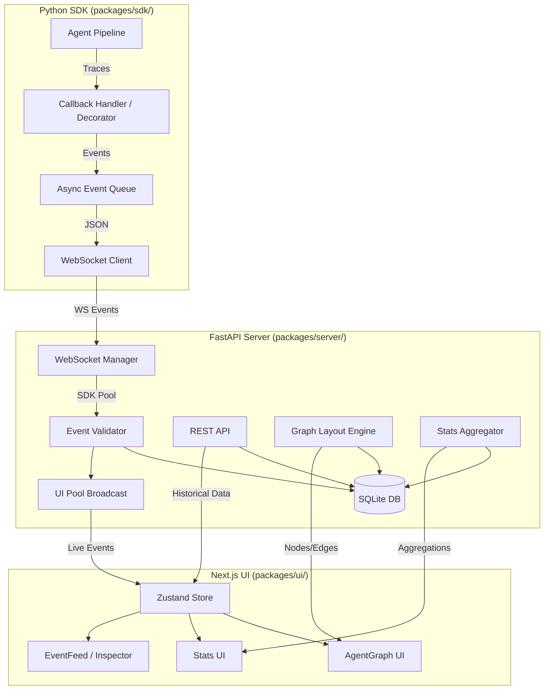
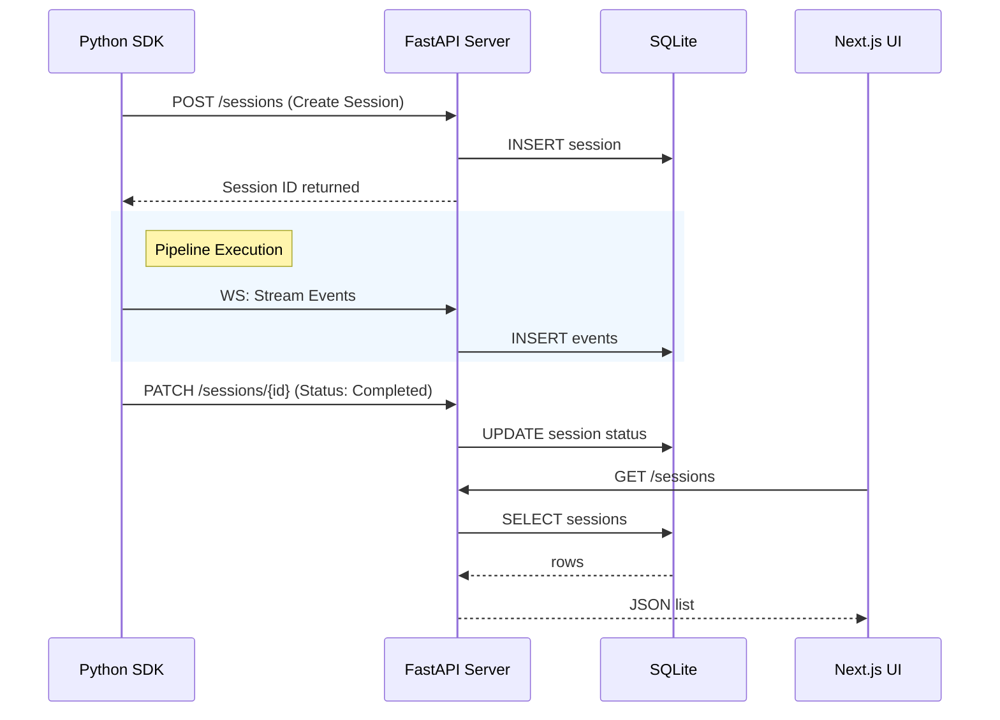
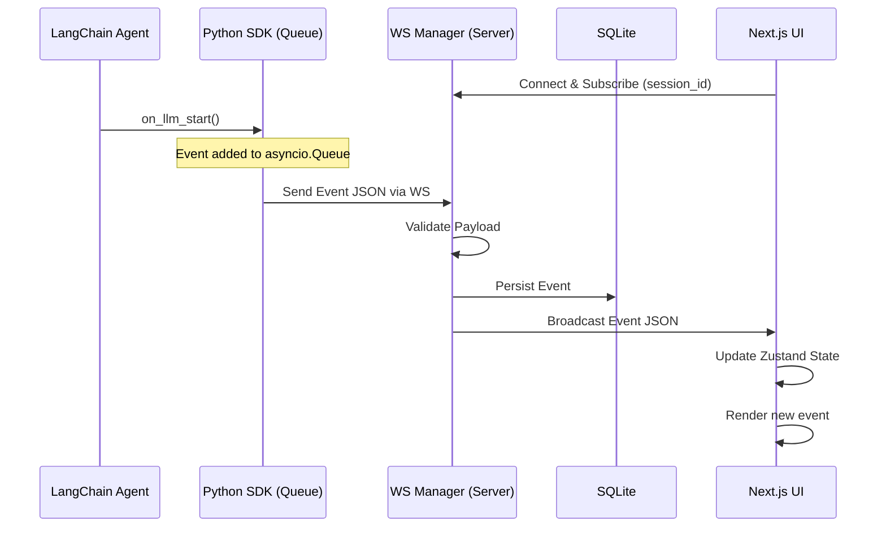
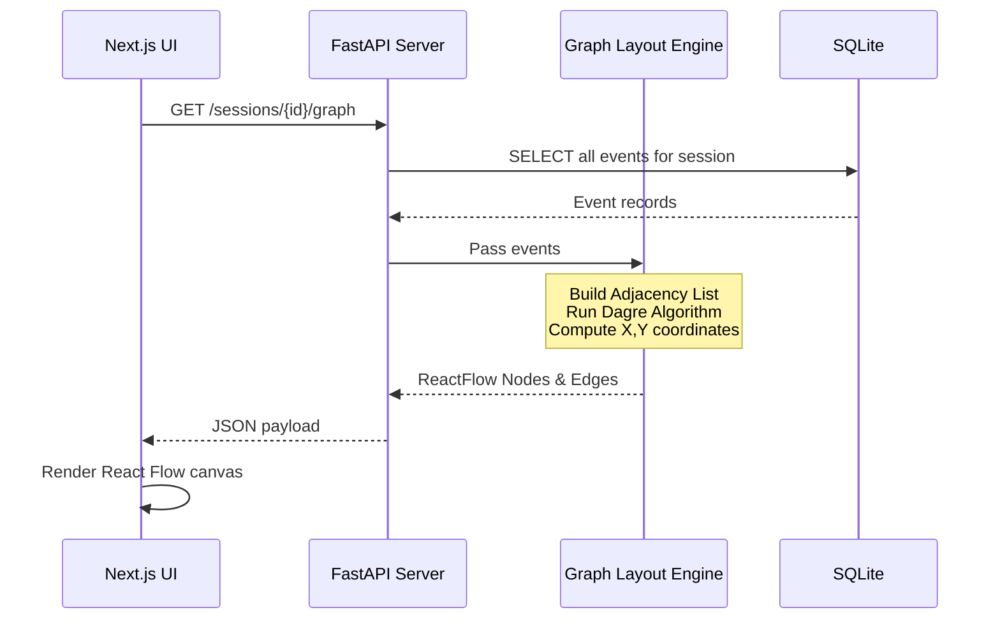

# AgentScope Technical Design Document

## 1. System Overview

AgentScope is a lightweight, open-source, self-hosted observability dashboard for multi-agent AI pipelines. It provides developers with real-time insights into agent execution, LLM calls, tool usage, and overall pipeline structure. 

The system consists of three core modules:
1. **Python SDK**: A lightweight tracing library that instruments agent pipelines (primarily LangChain) and pushes events to the server.
2. **FastAPI Server**: The backend that ingests events, persists them to a local SQLite database, processes data (like graph layout), and serves it to the UI.
3. **Next.js UI**: The frontend dashboard that visualizes agent sessions, execution graphs, real-time event feeds, and aggregated statistics.

**Data Flow**: Data flows in one direction from the SDK to the Server, and then to the UI. The UI only reads data, with the exception of deleting sessions.

**Technology Choices & Rationale**:
- **Python (SDK & Server)**: Native language for AI/LLM development (LangChain, etc.). FastAPI provides high performance for API and WebSocket handling.
- **SQLite**: Zero-configuration, local-first database perfect for a self-hosted developer tool.
- **Next.js & React**: Industry standard for building interactive dashboards.
- **WebSockets**: Essential for real-time observability without polling overhead.

## 2. Architecture Diagram

## 3. Module Deep Dives

### 3.1 Python SDK (`packages/sdk/`)

- **Callback Handler**: Subclasses LangChain's `AsyncCallbackHandler`. Each method (`on_chain_start`, `on_llm_start`, `on_tool_start`, etc.) creates an `AgentEvent` and calls `_emit()`. Uses LangChain's native `run_id` as the `event_id` and `parent_run_id` as the `parent_event_id` to effortlessly reconstruct the execution tree.
- **WebSocket Client**: Runs as a background `asyncio` task. Maintains a persistent connection to the FastAPI server. Uses an `asyncio.Queue` for event buffering to handle bursts. Implements exponential backoff for reconnection (1s, 2s, 4s, 8s, max 30s). All event emissions are fire-and-forget—the SDK never blocks the agent pipeline.
- **`@trace` Decorator**: Used for instrumenting non-LangChain functions. Creates a span by generating a start event when the function is called and an end event upon return. Captures exceptions automatically as error events.
- **Session Management**: Automatically creates a new session via `POST /sessions` on the first event emission. Sends a `PATCH` request to update the session status upon pipeline completion or error.

### 3.2 Server (`packages/server/`)

- **FastAPI Application**: Mounts REST routers for sessions and events. Configured with CORS middleware to allow all origins for local development. Uses a lifespan handler for robust database initialization and teardown.
- **WebSocket Manager (`ws_manager.py`)**: Maintains two distinct connection pools:
  - *SDK Pool*: Receives incoming events from SDK instances.
  - *UI Pool*: Sends real-time event broadcasts to connected browser clients.
  Upon receiving an SDK event, it validates the payload, persists it to the database, and broadcasts it to UI clients subscribed to that specific `session_id`.
- **Database Layer**: Built with SQLAlchemy 2.0 and an async engine. Uses SQLite in WAL (Write-Ahead Logging) mode to support concurrent reads while writing. Key tables: `sessions`, `events`. Indexes are placed on `session_id`, `timestamp`, and `event_type` for query performance.
- **Graph Layout (`graph_layout.py`)**: Responsible for computing the DAG layout server-side using the `dagre` algorithm (or a Python equivalent like `networkx`). It reads session events, builds an adjacency graph using `parent_event_id`, computes X/Y coordinates for each node, and returns a format directly compatible with React Flow nodes and edges. This ensures deterministic layouts across UI clients.
- **Stats Aggregation**: Queries the `events` table to calculate token sums, latency averages, and error counts, grouped by agent or step. Computes token usage timelines for charting.

### 3.3 UI (`packages/ui/`)

- **State Management**: Uses a Zustand store to hold the session list, active session details, and live events. The main dashboard page dispatches incoming WebSocket messages directly to the store.
- **Data Fetching**: Uses the browser `fetch` API for REST endpoints, polling the session list every 4 seconds and fetching events, graph data, statistics, and memories when a session or tab changes. Historical REST data is merged with live WebSocket events.
- **Pages**: The current UI exposes a single `/` dashboard route. It combines the session list, execution event feed, graph, statistics, prompt-diff view, import/export controls, and memory-management tab in one page rather than using separate dynamic session routes.
- **WebSocket behavior**: The dashboard connects to the UI WebSocket for the active session, filters messages by `session_id`, and retries after a fixed 2-second delay when the connection closes.
- **Key Components**:
  - `app/page.tsx` — Main dashboard implementation containing session selection, event feed, graph/statistics rendering, memory management, and WebSocket handling.
  - `components/PromptDiffViewer.tsx` — Prompt/completion difference viewer used by the event inspector.
  - `store/sessionStore.ts` — Zustand state for sessions, the active session, events, and session metadata updates.
  - `types/index.ts` — Shared TypeScript contracts for sessions, events, graph nodes, and graph edges.

## 4. Key Design Decisions

1. **Use LangChain's `run_id` as `event_id`**
   - *What*: We map LangChain's UUIDs directly to our event IDs.
   - *Why*: Avoids building an ID mapping layer and makes tree reconstruction trivial since LangChain natively tracks `parent_run_id`.
   - *Alternatives*: Generating our own UUIDs, which would require maintaining state maps during SDK execution.

2. **Server-side graph layout (dagre)**
   - *What*: X/Y positions for DAG nodes are computed on the FastAPI server before being sent to the UI.
   - *Why*: Ensures deterministic layouts regardless of the client, keeps the UI stateless regarding layout math, and avoids browser CPU spikes on large graphs.
   - *Alternatives*: Client-side layout (e.g., dagre.js in the browser), which can cause layout shifts and UI thread blocking.

3. **SDK never blocks agent pipeline**
   - *What*: SDK uses an `asyncio.Queue` and background task for fire-and-forget event emission.
   - *Why*: Observability should never impact the performance or stability of the primary application.
   - *Alternatives*: Synchronous HTTP calls, which would drastically increase LLM pipeline latency.

4. **Token cost estimated, not exact**
   - *What*: We rely on LLM response metadata (e.g., OpenAI's `usage` object) to track tokens. If absent, we display '—' rather than trying to calculate it exactly.
   - *Why*: Calculating exact tokens requires heavy dependencies like `tiktoken` in the SDK, which bloats the package and requires model-specific logic.
   - *Alternatives*: Bundling tokenizers in the SDK or server.

5. **SQLite with WAL mode**
   - *What*: Using local SQLite configured with `PRAGMA journal_mode=WAL;`.
   - *Why*: Perfect for a zero-config local developer tool. WAL mode allows the UI to run heavy read queries while the SDK is simultaneously streaming hundreds of write events.
   - *Alternatives*: PostgreSQL (requires user setup via Docker) or in-memory DB (loses history across restarts).

6. **React Flow over D3**
   - *What*: Using the React Flow library for the DAG visualization.
   - *Why*: Purpose-built for rendering node-edge graphs in React. It handles zooming, panning, and selection out of the box, saving weeks of development time.
   - *Alternatives*: D3.js (powerful but requires manual DOM manipulation in React) or specialized DAG libraries (less customizable).

7. **Tailwind + shadcn/ui only**
   - *What*: Building UI components using Tailwind CSS and Radix primitives (shadcn/ui).
   - *Why*: Keeps the bundle small and avoids the visual baggage and performance overhead of heavy component libraries.
   - *Alternatives*: Material UI (MUI) or Chakra UI.

8. **WebSocket dual pool**
   - *What*: The Server maintains separate logic/pools for SDK publishers and UI subscribers.
   - *Why*: Clean separation of concerns. SDKs only push data, UIs only pull data. Prevents accidental broadcasting of events back to an SDK.
   - *Alternatives*: A single generic PubSub pool.

## 5. Sequence Diagrams

### Session Lifecycle

### Real-time Event Flow

### Graph Rendering

## 6. Error Handling Strategy

- **SDK**: All callbacks are wrapped in broad `try/except` blocks. Errors are caught, logged as warnings (`logging.warning`), and never propagated back to the underlying agent pipeline. The agent must run even if observability fails.
- **Server**: Standard HTTP error responses using appropriate status codes (400 for bad payloads, 404 for missing entities, 422 for validation errors, 500 for server errors) containing detailed error body descriptions.
- **WebSocket**: Client implements exponential backoff reconnection logic. During disconnection periods, events are buffered in memory up to a configurable limit before being dropped.
- **UI**: Utilizes React Error Boundaries to prevent full app crashes. Displays toast notifications for transient API failures and renders friendly empty/error states for major data loading failures.

## 7. Performance Considerations

- **SDK**: The combination of `asyncio.Queue` and a background drain task ensures that the tracing callback returns in < 1ms, preventing any slowdown to LLM generation.
- **Server**: SQLite WAL mode allows concurrent read/write operations. Indexes on hot columns (`session_id`, `timestamp`) keep queries fast. Pagination is implemented on list endpoints to handle thousands of past sessions.
- **UI**: The event feed uses a virtualized list to efficiently render thousands of events without DOM bloat. React Flow is natively optimized for handling large graphs. SWR caching prevents redundant API calls on navigation.

## 8. Security Model

- **Scope**: Designed as a local-only developer tool. There is no authentication or authorization in v1.
- **CORS**: Configured to allow all origins to facilitate painless local development across different localhost ports.
- **Data Storage**: SQLite file is stored locally with standard user-level permissions.
- **Network**: The server makes no external network calls; everything runs locally.
- **Privacy Warning**: Traced events will contain sensitive information, including full LLM prompts, tool inputs, and potentially API keys if passed in prompts. Users are responsible for securing their local environment and database file.

## 9. Deployment Architecture

- **Docker Compose**: The recommended deployment method groups the Server (FastAPI running on Uvicorn) and the UI (Next.js standalone build) as two services.
- **Volumes**: The SQLite database (`agentscope.db`) is mounted to a host filesystem volume for persistence across container restarts.
- **Ports**: Exposes port `8765` for the FastAPI server and `3000` for the Next.js UI.
- **Dependencies**: Fully self-contained. No external services (no Redis, no Postgres, no cloud accounts) are required to run the stack.

## 10. Future Architecture Considerations

- **PostgreSQL Adapter**: Support swapping SQLite for PostgreSQL via a `DATABASE_URL` environment variable for team deployments.
- **Multi-framework Support**: Adapters for CrewAI, AutoGen, and raw OpenAI SDKs, expanding beyond LangChain.
- **Live DAG Updates**: Pushing incremental node/edge updates via WebSockets rather than requiring REST refreshes for the graph view.
- **Session Diffing**: Infrastructure to compare two runs side-by-side (e.g., comparing token usage or latency before and after a prompt change).
- **Plugin System**: Allow users to register custom event types and provide custom UI components to render them in the inspector.
